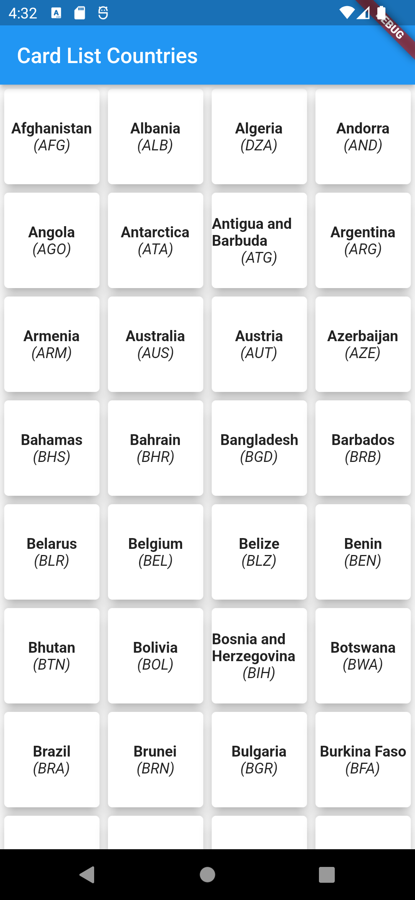
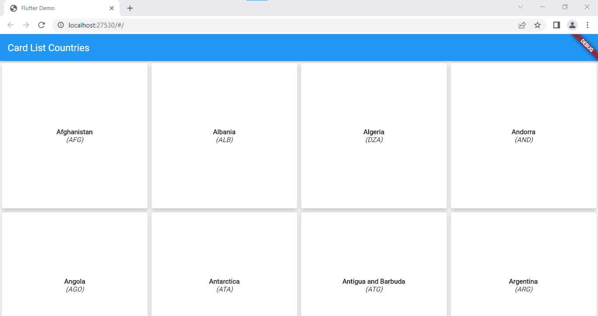

# tugas2_Card List Countries Api

Created in order to accomplish Assignment 2 Praktikum Pemrograman Aplikasi Mobile.

by:
```
Name  : Habib Al Fauzan
NIM   : 124200070
Plug  : C
```

## Getting Started
To run this app, run following command:
```
flutter pub get
flutter run
```

## Screenshot
&nbsp;
